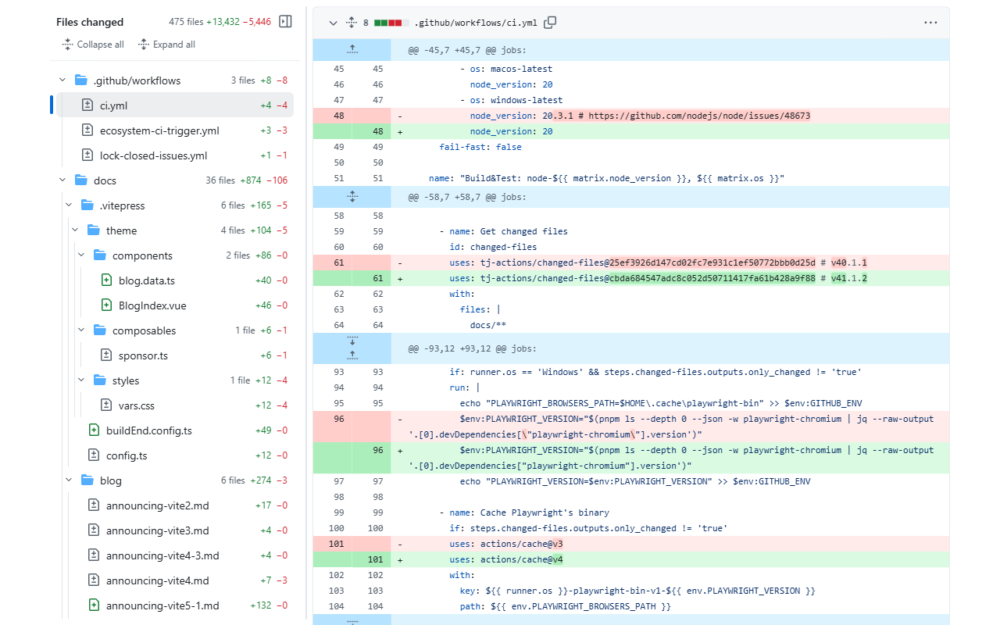

# Compare Tree for GitHub

A Chrome extension that adds a pull-request-style tree of changed folders and files to GitHub's
branch compare page (`github.com/<owner>/<repo>/compare/<base>...<head>`), with per-folder change
counts and click-to-jump to each diff. See what a branch touches without opening a pull request.



## Features

- Folder tree of every changed file, like the PR "Files changed" sidebar. Folders that only hold
  one sub-folder fold into a single row (`src/main/java/com/acme`).
- Per-file additions and deletions, status icons for added, modified, removed, and renamed files.
- Per-folder rollups: file count, additions, deletions.
- Click a file to jump to its diff, even before GitHub has streamed that part of the page.
- The file under the viewport top is highlighted as you scroll.
- Drag the divider to resize the tree (arrow keys work too, double-click resets). The width is
  remembered.
- Stays responsive on compares with thousands of files.
- Follows GitHub's light, dark, and dimmed themes.
- Works on private repositories through your existing GitHub session. No token, no setup.

## How it works

The extension downloads the compare's `.diff` from github.com (the same request your browser
would make if you opened the compare URL with `.diff` appended), parses it, and renders the tree
beside GitHub's diff list. It needs only the `storage` permission, to remember whether you hid the
sidebar and how wide you made it. It makes no other network requests and collects no data. The script loads on every
github.com page because GitHub changes pages without a full reload, and stays idle until the URL
is a compare range.

## Install

From the Chrome Web Store: link to follow once the listing is live.

From source:

```bash
pnpm install
pnpm build
```

Then open `chrome://extensions`, enable Developer mode, choose "Load unpacked", and select
`.output/chrome-mv3`.

## Develop

```bash
pnpm dev        # watch mode, opens a Chrome profile with the extension installed
pnpm test       # unit tests
pnpm typecheck
pnpm zip        # store zip in .output/
```

## Limits

- Compare pages on github.com only. Commit pages, pull requests, and GitHub Enterprise Server
  hosts are not supported yet.
- The tree is rebuilt from GitHub's diff download; if GitHub ever truncates that download, the
  sidebar shows a warning with both counts.

## License

MIT
